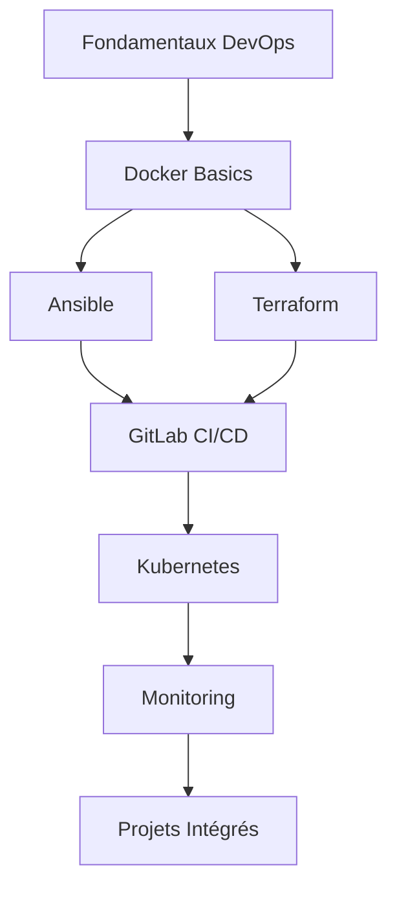

# Design Document - Plateforme de Cours DevOps

## Overview

La plateforme de cours DevOps sera construite comme un site statique utilisant Jekyll et GitHub Pages, avec une structure modulaire permettant un apprentissage progressif. Le contenu sera organisé en modules thématiques avec des exercices pratiques utilisant Docker pour créer des environnements d'apprentissage isolés et reproductibles.

## Architecture

### Structure du Site

```
devops-course/
├── _config.yml                 # Configuration Jekyll
├── index.md                    # Page d'accueil
├── _layouts/                   # Templates Jekyll
│   ├── default.html
│   ├── course.html
│   └── exercise.html
├── _includes/                  # Composants réutilisables
│   ├── navigation.html
│   ├── docker-setup.html
│   └── references.html
├── assets/                     # CSS, JS, images
│   ├── css/
│   ├── js/
│   └── images/
├── modules/                    # Modules de cours
│   ├── 01-fundamentals/
│   ├── 02-ansible/
│   ├── 03-terraform/
│   ├── 04-gitlab-ci/
│   ├── 05-docker/
│   ├── 06-kubernetes/
│   ├── 07-monitoring/
│   └── 08-projects/
└── docker-environments/       # Environnements Docker pour exercices
    ├── ansible-lab/
    ├── terraform-lab/
    ├── gitlab-runner/
    └── monitoring-stack/
```

### Parcours d'Apprentissage



## Components and Interfaces

### 1. Module de Cours (Course Module)

Chaque module suit une structure standardisée :

```markdown
# Module X - [Nom du Module]

## Objectifs d'Apprentissage
- Objectif 1
- Objectif 2

## Prérequis
- Prérequis 1
- Prérequis 2

## Contenu Théorique
### Section 1
### Section 2

## Exercices Pratiques
### Exercice 1 - [Nom]
#### Environnement Docker
#### Instructions
#### Validation

## Projet du Module
### Description
### Livrables
### Critères d'Évaluation

## Sources et Références
- [Source 1](url)
- [Source 2](url)
```

### 2. Environnement Docker

Chaque exercice pratique inclut :

- **docker-compose.yml** : Configuration des services nécessaires
- **Dockerfile** personnalisés si nécessaire
- **Scripts d'initialisation** : Setup automatique de l'environnement
- **Scripts de nettoyage** : Suppression propre des ressources

### 3. Système de Navigation

- **Navigation principale** : Accès aux différents modules
- **Navigation intra-module** : Progression dans le module
- **Indicateurs de progression** : Visualisation de l'avancement
- **Liens de référence croisée** : Connexions entre modules

### 4. Composant de Références

Template réutilisable pour afficher :
- Sources officielles
- Documentation complémentaire
- Articles et tutoriels
- Outils et ressources

## Data Models

### Structure des Métadonnées de Module

```yaml
# _data/modules.yml
modules:
  - id: "01-fundamentals"
    title: "Fondamentaux DevOps"
    level: "débutant"
    duration: "4 heures"
    prerequisites: []
    objectives:
      - "Comprendre les principes DevOps"
      - "Maîtriser les outils de base"
    
  - id: "02-ansible"
    title: "Ansible - Automatisation de Configuration"
    level: "intermédiaire"
    duration: "8 heures"
    prerequisites: ["01-fundamentals"]
    objectives:
      - "Créer des playbooks Ansible"
      - "Gérer des inventaires complexes"
```

### Structure des Exercices

```yaml
# _data/exercises.yml
exercises:
  - id: "ansible-basic-playbook"
    module: "02-ansible"
    title: "Premier Playbook Ansible"
    difficulty: "débutant"
    duration: "30 minutes"
    docker_environment: "ansible-lab"
    validation_script: "validate-playbook.sh"
```

## Error Handling

### Gestion des Erreurs Docker

1. **Vérification des prérequis** : Scripts pour vérifier Docker et docker-compose
2. **Gestion des ports** : Détection et résolution des conflits de ports
3. **Nettoyage automatique** : Scripts de cleanup en cas d'échec
4. **Messages d'erreur explicites** : Guide de dépannage pour les erreurs courantes

### Validation des Exercices

1. **Scripts de validation** : Vérification automatique des résultats
2. **Feedback utilisateur** : Messages clairs sur les erreurs et succès
3. **Hints progressifs** : Aide contextuelle en cas de difficulté

## Testing Strategy

### Tests de Contenu

1. **Validation Markdown** : Vérification de la syntaxe et des liens
2. **Tests de déploiement** : Validation du build Jekyll
3. **Tests de navigation** : Vérification des liens internes

### Tests d'Environnement Docker

1. **Tests de démarrage** : Vérification que tous les containers démarrent
2. **Tests de connectivité** : Validation des connexions entre services
3. **Tests d'exercices** : Exécution automatique des exercices avec validation

### Tests d'Intégration

1. **Pipeline CI/CD** : Tests automatiques sur chaque commit
2. **Tests cross-browser** : Validation sur différents navigateurs
3. **Tests de performance** : Temps de chargement et responsive design

### Structure des Tests

```
tests/
├── content/
│   ├── markdown-lint.yml
│   ├── link-checker.js
│   └── spelling-check.yml
├── docker/
│   ├── environment-tests.sh
│   ├── exercise-validation/
│   └── cleanup-tests.sh
└── integration/
    ├── build-test.yml
    ├── deployment-test.yml
    └── e2e-tests/
```

## Déploiement et Maintenance

### GitHub Actions Workflow

```yaml
# .github/workflows/deploy.yml
name: Deploy to GitHub Pages
on:
  push:
    branches: [ main ]
  pull_request:
    branches: [ main ]

jobs:
  test:
    runs-on: ubuntu-latest
    steps:
      - uses: actions/checkout@v2
      - name: Test Docker environments
      - name: Validate content
      - name: Build Jekyll site
  
  deploy:
    needs: test
    runs-on: ubuntu-latest
    if: github.ref == 'refs/heads/main'
    steps:
      - name: Deploy to GitHub Pages
```

### Maintenance Continue

1. **Mise à jour des dépendances** : Versions Docker, outils DevOps
2. **Amélioration du contenu** : Feedback utilisateurs, nouvelles technologies
3. **Optimisation des performances** : Temps de chargement, taille des images Docker
4. **Monitoring** : Analytics, erreurs utilisateurs, feedback